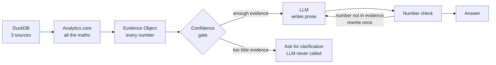

# KPI Intelligence Engine

**Accenture Hackathon · Round 2 · Track 3 — BusinessIntelligence.ai**

A system that detects a material movement in a business metric, explains what caused it using methods that can be checked, and says plainly when it doesn't know.

| | |
|---|---|
| **Stack** | FastAPI + React |
| **Warehouse** | DuckDB |
| **Domain** | Retail / e-commerce |
| **LLM** | Free tier (Gemini/Groq), swappable, Ollama fallback |

---

## 1. The idea in one paragraph

The brief says the LLM must not be the source of quantitative truth. So we split the system in two.

A **deterministic core** computes every number — the movement, the causes, the confidence — using arithmetic and statistics. The **LLM only turns those numbers into sentences.** It never calculates anything, and when the core isn't confident, the LLM is never called at all.

Everything below follows from that one split.

---

## 2. The stack

| Layer | What we use | Why |
|---|---|---|
| **Data** | DuckDB | Holds our three fake source systems in one file. Real SQL, real joins, no server to run. Lets us demo "three sources at different grains" honestly. |
| **Analytics** | pandas, statsmodels, scipy, EconML | Where all the maths happens. statsmodels for seasonality, EconML for the causal step. This layer produces every number. |
| **API** | FastAPI + Pydantic | Pydantic types the Evidence Object, so numbers can't be malformed by the time they reach the LLM or the screen. |
| **Language** | Gemini / Groq free tier, Ollama fallback | Writes the narrative. Behind an interface, so we can switch providers or go fully offline for the demo. |
| **Interface** | React + Vite + Recharts | Three screens: KPI view, evidence drawer, cost & latency panel. |

### The three data sources

Deliberately mismatched — the mismatches are what force the interesting problems to actually get solved rather than described.

| Source | Grain | Refresh | The problem it creates |
|---|---|---|---|
| Sales | order line × day | daily | — our baseline |
| Marketing | campaign × **week** | 6-hourly | Weekly spend must be split into days before it can be compared to daily revenue |
| Inventory | SKU × day | daily, **2 days late** | Any conclusion leaning on stock data must be flagged as based on stale numbers |

### The five KPIs

Not five unrelated metrics — a tree, which is what lets us trace a movement downward instead of guessing.

```
Net Revenue  =  Orders × AOV  −  Returns

     Orders  =  Sessions × Conversion Rate
     AOV     =  Units per Order × Average Selling Price

Gross Margin %  =  (Net Revenue − COGS) / Net Revenue
Fill Rate       ← supply constraint, feeds Orders
```

---

## 3. How a question flows through it



The gate is the important part. **Abstention is decided by arithmetic before the LLM is reached**, so the model has no opportunity to invent a confident answer.

---

## 4. The analytical model

The engine always answers the same question: *a KPI moved by Δ — what accounts for Δ?*

It works through five rungs in order. Each rung explains as much of Δ as it honestly can and passes the rest down. The top rungs are plain arithmetic and assume nothing. The lower rungs need assumptions, so those get stated. Whatever is left unexplained at the bottom becomes the confidence score.

### Rung 0 — What should have happened `statistics`

Δ is not "this week versus last week". Revenue falling 8% in January isn't news if January always falls 9%. So we build an expectation first and measure against that.

```
y(t)     =  trend + seasonal + residual     (STL decomposition)
expected =  trend + seasonal
Δ        =  actual − expected
```

A movement is worth reporting only if it clears **both** a statistical bar and a money bar. Significance alone flags trivia; size alone flags Christmas.

### Rung 1 — Which part of the tree `exact`

Revenue is `Sessions × Conversion × Basket × Price`. We want to know how many pounds of the drop came from each. The obvious approach — change one, hold the rest — leaves a leftover chunk nobody can explain.

Instead we use **LMDI**, a method from index theory that splits a multiplication into parts that add up *exactly*, with nothing left over.

```
ΔV  =  Σᵢ  L(V₁,V₀) · ln(xᵢ₁ / xᵢ₀)

L(a,b) = (a − b) / (ln a − ln b)      the logarithmic mean
```

Output: *"£310K of the £508K gap came from conversion, £140K from price."* No model involved, so it cannot be wrong.

### Rung 2 — Price, volume, or mix `exact`

Once price is implicated, split it three ways. This is the standard finance bridge, and it also adds up exactly.

```
Volume  =  (Q₁ − Q₀) · p̄₀            we sold fewer units
Mix     =  Σ q₁ₛ·p₀ₛ − Q₁·p̄₀         customers shifted to cheaper items
Price   =  Σ q₁ₛ·(p₁ₛ − p₀ₛ)         we changed our prices
```

**Mix is the one worth having.** Revenue can fall while every price rose and unit counts held flat, purely because demand shifted to cheaper products. That's invisible without this split, and any finance person in the room will recognise the bridge immediately.

### Rung 3 — Which region, channel, product `exact`

Now *where*. The naive approach ranks slices by size of change, which just returns your biggest markets every time. We rank by **surprise** instead — how far a slice departed from its own expected share.

```
explanatory power  =  Δ_slice / Δ_total
surprise           =  divergence(actual share, expected share)
```

A big region moving proportionally is not the story. A small region breaking its own pattern is. We search top-down, splitting on whichever dimension concentrates the most unexplained movement, three levels deep.

### Rung 4 — Outside causes `assumptions`

Marketing spend, competitor pricing, stockouts. These aren't parts of the KPI formula, so exact arithmetic runs out here and estimation begins. Two steps:

1. **Shortlist** candidates by lagged correlation — clearly labelled as association, not cause.
2. **Test the top one only**, using a control group that wasn't affected:

```
effect = (treated after − treated before)
       − (control after − control before)

reported with a confidence interval and its assumption stated
```

Every number from this rung carries a range, not a point. That difference is visible in the interface.

### Rung 5 — What's left over becomes confidence `the gate`

After four rungs, some of Δ is still unaccounted for. That leftover is the honest confidence signal — we don't invent a number, we measure our own coverage.

```
coverage   = explained Δ / total Δ

confidence = f(coverage, data freshness, history depth,
               method strength, contradictions found)
```

Three outcomes:

- **Confident** → write the narrative
- **Qualified** → write it with caveats and an alternative explanation
- **Abstain** → say what's missing and ask, without calling the LLM

### Worked example — a −£508K gap

| Rung | Method | Explains | Assumes |
|---|---|---|---|
| 1–2 | LMDI + price/volume/mix | −£284K | nothing — exact arithmetic |
| 3 | dimensional attribution | −£57K | nothing — exact, ranked by surprise |
| 4 | causal estimate | −£96K ± £45K | a valid control group |
| — | **unexplained** | **−£71K** | — |

Coverage 86% → **qualified, not confident.** The engine hedges, and can say exactly why.

---

## 5. Where machine learning sits

ML never produces a number that appears in a sentence, because those numbers need to reconcile exactly. It does everything around them.

| Job | Model | What it adds |
|---|---|---|
| Spotting anomalies | Isolation Forest | Catches odd *combinations* — revenue looks flat because conversion up and basket down cancel out |
| Estimating causes | **Double ML** | Uses ML to make a causal estimate valid, and shows which segments reacted most |
| Calibrating confidence | **Isotonic regression** | Learns from analyst feedback so "confidence 0.8" comes to mean 80% were actually right |
| Finding precedents | Nearest neighbour | "This looks like the March stockout" — and what was done about it then |

> **One thing to avoid:** using SHAP values as the contribution numbers. SHAP explains what drove a *model's prediction*, not what drove the *business outcome*. Presenting one as the other invites a question we couldn't answer. Fine for shortlisting candidates; never for a figure we quote.

---

## 6. Build order

Roughly nine days of effort, less in calendar time with three people.

1. **Fake data with known answers** — a generator that plants specific causes: a promotion in week 32, a stockout on one product, a competitor price cut. Highest-leverage step, because it's how we prove the engine finds what's actually there.
2. **The KPI contract** — one YAML file per KPI holding its definition, thresholds, candidate drivers, and who's allowed to see what. Everything reads from it, so nothing is hardcoded.
3. **Loading and reconciling** — three sources into DuckDB, calendars and grains aligned, freshness recorded.
4. **Detection** — Rung 0. Baselines, and ranking movements by significance and size together.
5. **Explanation** — Rungs 1 through 4. The core of the project, and where the time should go.
6. **Confidence and abstention** — Rung 5, plus the actions each driver maps to.
7. **Narrative and telemetry** — the LLM layer, the number check, the personas, the cost/latency panel.
8. **Interface and demo** — three React screens, then rehearse the scenarios end to end.

After steps 1 and 2 the work splits three ways — analytics, narrative, interface — with the Evidence Object as the agreement between them. Which is why that schema is worth settling early.

---

*Working draft — scope and estimates to be confirmed with the team.*
