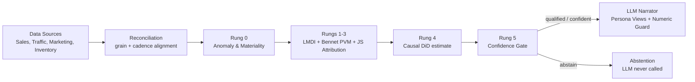

# BusinessIntelligence.ai

> **Don't just tell me what changed. Tell me why — and what to do next.**

Most BI tools stop at the dashboard: they'll show you that revenue dropped, but leave the root-cause investigation to an analyst manually cross-tabulating spreadsheets across systems that don't even agree on time grain. Pure LLM approaches "solve" this by having a model reason over raw numbers directly — and inherit the model's willingness to hallucinate a plausible-sounding explanation even when the underlying arithmetic is wrong.

**BusinessIntelligence.ai** takes a different position: **the LLM never becomes the source of quantitative truth.** Every number a user sees — variance, attribution, confidence — is produced by deterministic arithmetic, statistics, or a trained ML model. The LLM's only job is to turn already-verified evidence into a narrative a specific business persona can act on, and a numeric guard rejects anything it writes that isn't traceable back to that evidence.

**Compute first. Explain second.**

---

## The problem, in one picture

```
Data Sources → Dashboards → Analyst Investigation → Business Decision
  (Sales, Traffic, (metric        (export data,
   Marketing,       moved)         reconcile systems,
   Inventory)                      find correlations,
                                    build slides)
```

The bottleneck isn't reporting — it's **decision latency**. Five things routinely break this pipeline:

1. **Fragmented data** — sales, web traffic, marketing spend and inventory operate at different grains and refresh on different clocks.
2. **KPI movement ≠ KPI explanation** — a dashboard can tell you Net Revenue is down 12%. It can't tell you why.
3. **No single source of truth** — reconciling systems by hand is where most analyst time goes.
4. **LLMs can explain, but they can hallucinate** — an LLM should never be trusted to perform business arithmetic.
5. **Insight doesn't automatically become action** — even after finding a driver, someone still needs an owner, a lever, and a next step.

---

## How BusinessIntelligence.ai is different

| Traditional GenAI BI | BusinessIntelligence.ai |
|---|---|
| LLM interprets raw data | Deterministic engine computes evidence |
| Text-to-SQL can introduce silent errors | Governed KPI contract (YAML) defines every calculation |
| AI may perform arithmetic | LLM never performs arithmetic |
| One generic answer for everyone | Persona-specific narratives (CFO, EU Category Manager, Analyst) |
| Always tries to answer | Can explicitly **abstain** when confidence is low |
| Insight ends at explanation | Driver → Lever → Action → Owner |
| Static, one-shot output | Analyst feedback loop actually recalibrates future confidence scores |

---

## Architecture & data flow



**The pipeline, stage by stage** (each "rung" explains as much of the gap as it honestly can, in order):

1. **Reconciliation** — sales and web traffic (daily), marketing spend (weekly, allocated evenly across days and flagged as such), and inventory (daily, 2-day known lag) are aligned onto one analysis grid without losing source grain, and every input carries freshness metadata.
2. **Rung 0 — detection** — a movement has to clear both a statistical bar (z-score vs. an STL baseline, backtested — not just "this week vs. last week") and a business bar (a currency floor) before it's surfaced as material.
3. **Rungs 1–2 — exact decomposition** — LMDI splits the revenue identity (Sessions × Conversion × AOV − Returns) into additive components with zero residual; a Bennet indicator further splits price into price, volume and mix. No model involved — this cannot be wrong.
4. **Rung 3 — dimensional attribution** — which region/channel/category/SKU is responsible, ranked by Jensen-Shannon divergence ("surprise" — how far a slice departed from its expected share) rather than by raw size.
5. **Rung 4 — causal estimate** — for drivers outside the KPI formula (marketing, competitor pricing, stockouts), a difference-in-differences estimate with a real parallel-trends check, reported with a confidence interval, never a bare point estimate.
6. **Rung 5 — confidence gate** — whatever's left unexplained becomes the honest confidence signal, combined with data freshness, history depth and cross-source contradictions. Below the qualified threshold, the LLM is **never called**.
7. **Persona narration** — once evidence clears the gate, the LLM turns it into role-specific language. A numeric guard strips every figure out of its draft and rejects anything not traceable to the evidence object. If no LLM provider is configured, a deterministic template narrator is used instead — and is honestly labeled as such, never disguised as a model output.

### Why abstention matters

Imagine marketing conversions spike while POS transactions fall at the same time — a classic symptom of a broken tracking pixel. A naive system would confidently declare "marketing caused the revenue decline." BusinessIntelligence.ai detects the contradiction, lowers confidence below threshold, and asks the analyst to verify instrumentation before attributing anything — without ever calling the LLM.

**A trustworthy AI system has to know when not to answer.**

---

## From insight to action

Finding a driver isn't the finish line. Every material driver is mapped through:

```
Driver → Controllable Lever → Prescriptive Action → Expected Impact → Owner → Confidence → Monitoring Plan
```

```
Recovery = |Contribution| × Reversal Fraction
```

Expected impact is always computed from the attributed contribution — never written by the model — and the UI lets you interactively adjust the reversal fraction to see the recovery recalculate live.

---

## Persona-specific intelligence

The same evidence produces different narratives and different masked columns depending on who's looking — enforced in the query, not just hidden in the UI:

- **CFO** — all regions, full financial detail.
- **EU Category Manager** — DE/FR/NL only; margin and cost figures are structurally excluded from the SQL before any computation runs, not merely hidden on screen.
- **Data Analyst** — all regions, plus the method/rung detail behind every figure.

---

## Tracked KPI tree

```
Net Revenue  =  Orders × AOV − Returns
     Orders  =  Sessions × Conversion Rate
     AOV     =  Units per Order × Average Selling Price

Gross Margin %  =  (Net Revenue − COGS) / Net Revenue
Fill Rate       ← supply constraint, feeds Orders
```

## Input data sources

| Source | Grain | Refresh Cadence | Handled Mismatch |
|---|---|---|---|
| Sales | Order line × Day | Daily | Baseline transactional grain |
| Traffic | Session × Day | Daily | Feeds the Sessions → Conversion → Orders chain |
| Marketing | Campaign × Week | 6-hourly | Weekly spend allocated evenly across days; every figure derived from it is tagged as allocated |
| Inventory | SKU × Day | Daily, 2-day known lag | Freshness score penalized against SLA |

---

## Governance & continuous learning

- **KPI semantic contract** (`contracts/kpis.yaml`) — every KPI's definition, calculation, materiality thresholds, drivers, levers, lineage and access restrictions live in one YAML file. Nothing about the business is hardcoded in Python. A second vertical (`contracts/kpis_saas.yaml`) is selectable via the `KPI_CONTRACT_PATH` environment variable, proving the contract is a real config surface rather than decoration.
- **Feedback loop** — analysts tag each driver/narrative as Correct, Wrong Driver, Missed Factor, Hallucination, Not Material, etc. Isotonic regression recalibrates the confidence score against these verdicts, and repeatedly-wrong drivers get a lower prior on future runs — persisted, and re-applied on the very next assessment, not just logged.

---

## Project structure

```
BusinessIntelligence.ai/
├── api/                    # FastAPI backend
│   ├── main.py              # REST endpoints + serves the built frontend
│   ├── service.py           # Orchestration, caching keys, warm-up profiling
│   └── cache.py             # In-memory TTL cache
├── engine/                  # Deterministic analytical core
│   ├── contract.py          # KPI contract loader (retail/SaaS selectable)
│   ├── warehouse.py         # DuckDB connection, grain reconciliation, freshness
│   ├── detect.py            # Rung 0 — anomaly & materiality
│   ├── decompose.py         # Rungs 1-2 — LMDI + Bennet price/volume/mix
│   ├── attribute.py         # Rung 3 — Jensen-Shannon dimensional attribution
│   ├── causal.py            # Rung 4 — difference-in-differences
│   ├── confidence.py        # Rung 5 — confidence scoring, abstention gate, learned recalibration
│   └── levers.py            # driver → lever → action → recovery
├── narrative/                # LLM layer
│   ├── provider.py          # Providers (offline mock / any OpenAI-compatible API) + telemetry
│   ├── synthesize.py        # Persona prompts, evidence rendering, the offline template
│   └── validator.py         # Numeric hallucination guard
├── feedback/                 # Learning loop
│   ├── store.py              # DuckDB-backed feedback/annotation persistence
│   └── learn.py               # Isotonic calibration + driver priors
├── contracts/
│   ├── kpis.yaml              # Retail semantic contract (active by default)
│   └── kpis_saas.yaml         # SaaS vertical contract (KPI_CONTRACT_PATH)
├── data/
│   ├── generate.py            # Synthetic data + planted ground-truth generator
│   └── raw/                   # Generated parquet extracts (gitignored; auto-created on first use)
├── web/                       # React + Vite frontend
│   └── src/pages/              # Overview, Investigate, Actions, Governance, FeedbackHub, Integrations
├── tests/
└── requirements.txt
```

---

## Getting started

### Prerequisites

- Python 3.10+
- Node.js 18+ (only needed if you want to rebuild the frontend — a built copy is committed under `web/dist`)
- Git

### 1. Backend

```bash
git clone https://github.com/SaiBalajiSonga/BusinessIntelligenceAI.git
cd BusinessIntelligenceAI

python -m venv venv
# Windows: .\venv\Scripts\Activate.ps1
# macOS / Linux: source venv/bin/activate

pip install -r requirements.txt
```

**(Optional) Configure an LLM provider** — create a `.env` file if you want a real model to write the persona narratives:

```
LLM_PROVIDER=groq          # or any OpenAI-compatible provider: nvidia, openrouter, ollama...
LLM_API_KEY=your_key_here
LLM_MODEL=llama-3.1-8b-instant
LLM_BASE_URL=https://api.groq.com/openai/v1
```

Without one, the engine uses a deterministic offline template narrator — every number is still real, it's just not phrased by a model, and the API honestly reports `llm_called: false` when this path is used.

### 2. Frontend

A built copy is already committed at `web/dist`, so this step is optional unless you're changing the frontend:

```bash
cd web
npm install
npm run build
cd ..
```

### 3. Run it

```bash
python -m uvicorn api.main:app --port 8000 --host 127.0.0.1 --env-file .env
```

(Drop `--env-file .env` if you didn't create one.)

The first request that touches the analytical engine generates the synthetic dataset automatically if `data/raw/` doesn't exist yet — expect the very first page load to take a few seconds longer than subsequent ones. To pre-generate it explicitly instead:

```bash
python data/generate.py
```

Then open **http://127.0.0.1:8000** — the FastAPI backend serves both the `/v1` API and the built React frontend on the same port. Swagger docs are at `/docs`.

### 4. Run the tests

```bash
pytest tests/ -v
```

Validates LMDI conservation (contributions always sum to the gap exactly), the causal estimator against planted ground-truth effects, the confidence gate and abstention logic, the numeric guard, and the feedback → recalibration loop end-to-end.

---

## Tech stack

| Layer | Tools |
|---|---|
| In-memory analytics | [DuckDB](https://duckdb.org/) |
| Statistics & causal inference | pandas, NumPy, statsmodels (STL baselines, OLS-based difference-in-differences) |
| ML | scikit-learn (isotonic regression for confidence calibration) |
| Schema contracts | Pydantic v2, PyYAML |
| API | FastAPI + Uvicorn |
| Frontend | React + Vite + TypeScript |
| Language synthesis | Any OpenAI-compatible provider (Groq, NVIDIA NIM, OpenRouter, Ollama, ...), with an offline deterministic template fallback |

Production compute can move from DuckDB to Snowflake, Databricks, or Microsoft Fabric without changing the underlying KPI contract or analytical logic.

---

## Roadmap

- **Phase 1 — Prototype** ✅ KPI intelligence · ✅ Attribution · ✅ Causal inference · ✅ Abstention · ✅ Persona narratives · ✅ Actions · ✅ Feedback loop (closes the loop, not just logs it)
- **Phase 2 — Enterprise hardening** → Real authentication (personas are currently a picker, not a login) · Snowflake / Databricks / Microsoft Fabric connectors · A decomposition tree for Gross Margin % and Fill Rate (currently monitored, not independently investigable) · Native lineage & audit
- **Phase 3 — Proactive intelligence** → Slack / Teams / Email alerts · Automated model retraining · Drift monitoring · Expanded KPI domains

---

## License

This project is licensed under the [MIT License](LICENSE).
