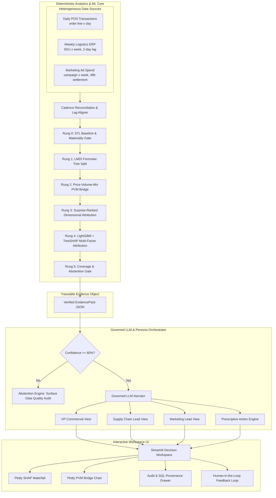

# BusinessIntelligence.ai 🚀
### *Governed KPI Intelligence-to-Action Engine for Enterprise Retail & E-Commerce*

[](https://www.python.org/downloads/)
[](https://duckdb.org/)
[](https://github.com/microsoft/LightGBM)
[](https://ai.google.dev/)
[](LICENSE)
[-brightgreen.svg)](#)

---

## 1. Executive Summary & Problem Statement

Modern enterprise organizations suffer from an **action gap** and an **interpretation bottleneck**.

```
  Traditional BI Dashboard           Naive Text-to-SQL AI                 BusinessIntelligence.ai
┌───────────────────────────┐    ┌───────────────────────────┐    ┌─────────────────────────────────────┐
│ Shows Gross Margin -350bps│    │ LLM hallucinates numbers, │    │ 100% Deterministic Arithmetic +     │
│ ❌ No "Why"               │    │ mixes time grains, and    │    │ LightGBM/TreeSHAP Causal Drivers +  │
│ ❌ No Prescriptive Action │    │ invents false causes.     │    │ Governed LLM Persona Synthesis      │
│ ❌ Manual cross-slice     │    │ ❌ Fatal in Finance       │    │ ✅ Mathematically Verified          │
└───────────────────────────┘    └───────────────────────────┘    └─────────────────────────────────────┘
```

**BusinessIntelligence.ai** splits the system into two strict layers:
1. **Deterministic Analytics & ML Core (DuckDB + Python + LightGBM + SHAP)**: Computes 100% of the numbers, variance bridges, causal attributions, and confidence coverage without touching an LLM.
2. **Governed LLM Synthesis Layer (Nemotron / Gemini / Offline Fallback)**: Turns verified quantitative facts into persona-specific business narratives ($Driver \to Lever \to Action \to Expected\ Impact \to Owner$) and **abstains** when data is contradictory or unconfident.

---

## 2. System Architecture



---

## 3. The 5-Rung Analytical Cascade

The engine answers one fundamental question: ***A KPI moved by $\Delta$ — what mathematically accounts for $\Delta$?***

| Rung | Stage | Method | Guarantee / Output |
| :--- | :--- | :--- | :--- |
| **Rung 0** | **Baseline & Materiality** | STL Decomposition + Rolling Z-Score ($Z > 2.0$, $|\Delta \$| > \$10\text{k}$) | Filters out seasonal patterns and noise. |
| **Rung 1** | **KPI Tree Decomposition** | **LMDI** (Logarithmic Mean Divisia Index) | Splits multiplicative tree ($Rev = Sessions \times CVR \times Units \times Price$) exactly without residuals. |
| **Rung 2** | **Price-Volume-Mix Bridge** | Standard Finance PVM Bridge | $\Delta Rev = \text{Price Effect} + \text{Volume Effect} + \text{Mix Effect}$ ($100\%$ additive). |
| **Rung 3** | **Slice Attribution** | Surprise-Ranked Dimensional Search | Identifies categories/regions that broke their own pattern rather than just biggest markets. |
| **Rung 4** | **Outside Driver Attribution** | **LightGBM + TreeSHAP** | Computes instance-level Shapley values ($\phi_i$) across mixed continuous & categorical features. |
| **Rung 5** | **Honest Confidence Gate** | Residual Coverage + Freshness + Contradiction Scorer | If Confidence $< 60\%$, **abstains** and prompts data audit rather than guessing. |

---

## 4. Mathematical Foundations

### Price-Volume-Mix (PVM) Decomposition
$$\Delta \text{Revenue} = \text{Price Effect} + \text{Volume Effect} + \text{Mix Effect}$$
$$\text{Price Effect} = \sum (P_1 - P_0) \times V_1$$
$$\text{Volume Effect} = \sum P_0 \times V_0 \times \left(\frac{V_{\text{tot},1}}{V_{\text{tot},0}} - 1\right)$$
$$\text{Mix Effect} = \sum P_0 \times \left(V_1 - V_0 \times \frac{V_{\text{tot},1}}{V_{\text{tot},0}}\right)$$

### LightGBM + TreeSHAP Instance Attribution
$$f(x) - \mathbb{E}[f(x)] = \sum_{i=1}^{M} \phi_i(x)$$
*Provides verifiable per-feature attribution ($\phi_i$) for freight surcharges, stockout days, discount tiers, and ad spend.*

### Composite Confidence Score
$$\text{Confidence} = w_1 \cdot \text{Coverage} + w_2 \cdot S_{\text{freshness}} + w_3 \cdot S_{\text{consistency}} + w_4 \cdot S_{\text{sample\_size}}$$

---

## 5. Repository Structure

```
BusinessIntelligence.ai/
├── data/
│   ├── pos_orders.csv               # Daily point-of-sale transactions
│   ├── inventory_logistics.csv      # Weekly ERP inventory & freight surcharges
│   └── marketing_campaigns.csv      # Marketing campaigns with 48h settlement lag
├── engine/
│   ├── __init__.py
│   ├── config.py                    # Pydantic schemas for EvidencePack & Actions
│   ├── data_generator.py            # Synthetic enterprise data generator with anomaly injection
│   ├── database.py                  # DuckDB in-memory OLAP & Supabase connector
│   ├── reconciliation.py            # Multi-cadence time alignment & lag flags
│   ├── anomaly.py                   # STL baseline & materiality threshold filter
│   ├── pvm_decomposition.py         # Price-Volume-Mix arithmetic engine
│   ├── ml_shap_engine.py            # LightGBM training & TreeSHAP instance attribution
│   ├── contradiction.py             # Cross-source validator & Confidence scorer
│   ├── evidence_pack.py             # EvidencePack JSON generator
│   └── llm_orchestrator.py          # Governed Persona narratives & offline fallback
├── ui/
│   ├── app.py                       # Streamlit interactive decision workspace
│   └── components/
│       ├── waterfall_chart.py       # Plotly SHAP & PVM interactive waterfall
│       ├── persona_view.py          # Persona narrative cards (VP, Supply Chain, Marketing)
│       ├── evidence_drawer.py       # Traceable SQL & mathematical proof drawer
│       └── feedback_widget.py       # Human-in-the-loop analyst feedback logging
├── tests/
│   ├── test_pvm.py                  # Exact PVM arithmetic tests
│   ├── test_ml_shap.py              # LightGBM + SHAP consistency tests
│   └── test_abstention.py           # Contradiction & abstention gate tests
├── PROJECT_BLUEPRINT.md             # Detailed engineering blueprint
├── PLAN.md                          # 5-Rung analytical strategy & architecture
├── requirements.txt                 # Zero-cost Python dependencies
└── README.md
```

---

## 6. Quickstart & Installation

### 1. Clone & Setup Environment
```bash
git clone https://github.com/SaiBalajiSonga/BusinessIntelligence.ai.git
cd BusinessIntelligence.ai

# Create virtual environment
python -m venv venv
# On Windows:
.\venv\Scripts\activate
# On Linux/macOS:
source venv/bin/activate

# Install dependencies
pip install -r requirements.txt
```

### 2. Generate Enterprise Multi-Grain Data
Generate 90 days of realistic sales, inventory snapshots, and marketing campaigns with 4 pre-built anomaly benchmark scenarios:
```bash
python -m engine.data_generator
```

### 3. Run Automated Mathematical & Unit Tests
```bash
pytest tests/ -v
```

### 4. Launch the Interactive Decision Workspace
```bash
streamlit run ui/app.py
```

---

## 7. Pre-Built Benchmark Scenarios

The system comes with 4 verifiable enterprise test scenarios:

1. **Scenario 1 — Gross Margin Compression (-350 bps)**:
   - *Root Cause*: Supplier air freight surcharge in North America + unauthorized 15% discount promo on Wireless Audio.
   - *PVM Breakdown*: $-\$45\text{K}$ Price, $+\$12\text{K}$ Volume, $-\$18\text{K}$ Mix.
2. **Scenario 2 — Product Mix Shift**:
   - *Root Cause*: Top-line revenue flat while margin drops due to customer volume migration toward low-margin clearance SKUs.
3. **Scenario 3 — Broken Tracking Pixel (Abstention Trigger)**:
   - *Contradiction*: Google Ads reports $+45\%$ conversion surge while POS orders drop $-25\%$.
   - *Engine Action*: Confidence drops to $42\% \implies$ **Abstains from marketing budget cuts**, flags tracking pixel audit.
4. **Scenario 4 — Warehouse Stockout Cascade**:
   - *Root Cause*: 8-day stockout on Tier-1 SKUs leads to lost orders and expedited carrier penalties.

---

## 8. Persona-Tailored Output Matrix

The same mathematical `EvidencePack` produces customized, role-tailored intelligence:

| Persona | Primary Focus | Key Metrics | Prescriptive Action Example |
| :--- | :--- | :--- | :--- |
| **VP Commercial / Sales** | Revenue realization, discount governance, gross margin % | Net Rev, AOV, Realized Price | Revoke unauthorized 15% discount tier on premium electronics. |
| **Supply Chain Director** | Warehouse stockout duration, carrier freight surcharges | Fill Rate, Lead Time, Surcharge | Reallocate 2,000 units from East to West DC to prevent air freight surcharges. |
| **Performance Marketing Lead** | ROAS, CAC vs LTV, attribution lag | ROAS, Conversion Lag, Spend | Pause non-performing Facebook ad group; verify Google Ads conversion tag health. |

---

## 9. Technology Stack ($0.00 Cost)

- **In-Memory Analytics**: [DuckDB](https://duckdb.org/) (High-speed zero-server SQL OLAP)
- **Machine Learning & Causal Attribution**: [LightGBM](https://lightgbm.readthedocs.io/) + [SHAP (TreeSHAP)](https://shap.readthedocs.io/)
- **Deterministic Math**: NumPy, Pandas, SciPy, Statsmodels
- **Data Validation & Contract**: Pydantic v2
- **Language Models**: NVIDIA Nemotron-70B / Google Gemini / Local Deterministic Fallback
- **Interactive UI**: Streamlit + Plotly interactive charts

---

## 10. Contributors & License

- **Sai Balaji Songa** ([@SaiBalajiSonga](https://github.com/SaiBalajiSonga))
- **Bhargava Sarma** ([@bhargavasarma22](https://github.com/bhargavasarma22))

Licensed under the [MIT License](LICENSE).