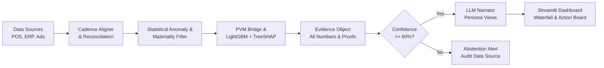

# BusinessIntelligence.ai

An analytical engine that detects material changes in business KPIs, identifies the root causes using deterministic arithmetic and machine learning (LightGBM + TreeSHAP), and generates persona-tailored action plans.

---

## Overview

Most BI tools display dashboards showing *that* a metric moved, but leave the root-cause diagnosis to manual cross-tabulation. Pure LLM approaches (like Text-to-SQL) often hallucinate calculations or mix mismatched time grains.

**BusinessIntelligence.ai** separates computation from narrative:
- **Deterministic & ML Core (Python, DuckDB, LightGBM, TreeSHAP)**: Computes 100% of the metric variances, Price-Volume-Mix (PVM) bridges, dimensional surprise rankings, and per-feature Shapley attributions.
- **Abstention Gate**: Evaluates data freshness, sample depth, and cross-source contradictions. If confidence falls below 60%, the engine abstains from speculative root-cause attribution and requests data verification.
- **Governed LLM Layer (Gemini / Nemotron / Local fallback)**: Converts the verified mathematical evidence into role-specific business narratives (Sales, Supply Chain, Marketing) without performing arithmetic.

---

## Architecture & Data Flow



---

## Core Capabilities

1. **Multi-Source Reconciliation**:
   - Reconciles daily transactional POS data with weekly ERP logistics snapshots and marketing ad spend (incorporating 48-hour attribution settlement windows).
2. **Deterministic Metric Decomposition**:
   - **Price-Volume-Mix (PVM)**: Decomposes revenue and margin variance into exact additive price, volume, and product mix components.
   - **Dimensional Surprise Ranking**: Ranks dimension contributions (Category, Region, Channel) by deviation from expected baseline shares.
3. **ML-Driven Causal Attribution (LightGBM + TreeSHAP)**:
   - Evaluates complex multi-factor interactions (e.g., `discount_rate × freight_surcharge × stockout_duration`) and computes instance-level Shapley values ($\phi_i$) for each driver.
4. **Honest Abstention Mechanism**:
   - Detects contradictory signals (e.g., ad conversions spiking while POS transactions drop due to a broken tracking pixel) and suppresses automated attribution when data quality thresholds are breached.
5. **Persona-Specific Action Recommendations**:
   - Maps identified drivers into actionable items: $Driver \to Lever \to Prescriptive\ Action \to Expected\ Impact \to Owner$.
   - Tailored views for **VP Commercial**, **Supply Chain Director**, and **Marketing Lead**.

---

## KPIs & Data Sources

### Tracked KPI Tree
- **Net Revenue**: $\text{Sessions} \times \text{Conversion Rate} \times \text{AOV} - \text{Returns}$
- **Gross Margin %**: $\frac{\text{Net Revenue} - \text{COGS}}{\text{Net Revenue}}$
- **Average Order Value (AOV)**: $\text{Units per Order} \times \text{Average Selling Price}$
- **Fill Rate & Stockout Duration** (Logistics & Supply Chain)
- **ROAS & CAC** (Performance Marketing)

### Input Data Sources
| Source | Granularity | Refresh Cadence | Handled Mismatch |
| :--- | :--- | :--- | :--- |
| **POS Sales** | Order line $\times$ Day | Daily | Baseline transactional grain |
| **Logistics ERP** | SKU $\times$ Week | Weekly (2-day lag) | Resampled to weekly alignment; freshness penalties |
| **Marketing Ads** | Campaign $\times$ Day | 6-hourly (48h lag) | Tagged with settlement window flag |

---

## Project Structure

```
BusinessIntelligence.ai/
├── data/                            # Generated enterprise datasets
│   ├── pos_orders.csv
│   ├── inventory_logistics.csv
│   └── marketing_campaigns.csv
├── engine/                          # Core analytical and ML modules
│   ├── config.py                    # Pydantic data schemas & contracts
│   ├── data_generator.py            # Multi-grain enterprise data generator
│   ├── database.py                  # DuckDB in-memory OLAP connection
│   ├── reconciliation.py            # Grain alignment & lag handler
│   ├── anomaly.py                   # STL baseline & Z-score filter
│   ├── pvm_decomposition.py         # Price-Volume-Mix calculation
│   ├── ml_shap_engine.py            # LightGBM + TreeSHAP driver attribution
│   ├── contradiction.py             # Confidence scorer & abstention gate
│   ├── evidence_pack.py             # Evidence object builder
│   └── llm_orchestrator.py          # Governed persona synthesis & fallback
├── ui/                              # User Interface
│   ├── app.py                       # Streamlit application entrypoint
│   └── components/                  # Waterfalls, drawers, and persona cards
├── tests/                           # Unit & integration test suite
│   ├── test_pvm.py
│   ├── test_ml_shap.py
│   └── test_abstention.py
├── requirements.txt
└── README.md
```

---

## Getting Started

### Prerequisites
- Python 3.10 or higher
- Git

### Installation

1. **Clone the repository:**
   ```bash
   git clone https://github.com/SaiBalajiSonga/BusinessIntelligence.ai.git
   cd BusinessIntelligence.ai
   ```

2. **Create and activate a virtual environment:**
   ```bash
   # Windows (PowerShell)
   python -m venv venv
   .\venv\Scripts\Activate.ps1

   # macOS / Linux
   python3 -m venv venv
   source venv/bin/activate
   ```

3. **Install dependencies:**
   ```bash
   pip install -r requirements.txt
   ```

4. **(Optional) Configure API keys:**
   Create a `.env` file in the root directory if you wish to use Gemini, NVIDIA Nemotron, or Groq for natural language synthesis. If omitted, the engine uses a built-in deterministic rule-based narrator:
   ```ini
   GEMINI_API_KEY=your_gemini_key_here
   # or
   NVIDIA_API_KEY=your_nvidia_key_here
   ```

---

## Usage

### 1. Generate Dataset with Benchmark Scenarios
Generate 90 days of multi-source enterprise data with pre-configured anomaly scenarios (e.g., Margin Drop, Product Mix Shift, Tracking Pixel Failure):
```bash
python -m engine.data_generator
```

### 2. Run Tests
Validate PVM mathematical balance, SHAP consistency, and the abstention gate:
```bash
pytest tests/ -v
```

### 3. Launch Dashboard
Start the interactive workspace:
```bash
streamlit run ui/app.py
```

---

## Tech Stack

- **In-Memory Analytics**: [DuckDB](https://duckdb.org/)
- **Machine Learning & Explainability**: [LightGBM](https://lightgbm.readthedocs.io/), [SHAP](https://shap.readthedocs.io/)
- **Data Manipulation & Statistics**: Pandas, NumPy, SciPy, Statsmodels
- **Schema Contracts**: Pydantic v2
- **Dashboard & Visualizations**: Streamlit, Plotly
- **Language Synthesis**: Google Gemini / NVIDIA Nemotron / Offline Rule Engine

---

## License

This project is licensed under the [MIT License](LICENSE).