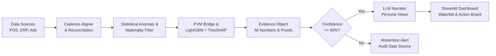

# BusinessIntelligence.ai

> **Don't just tell me what changed. Tell me why — and what to do next.**

Most BI tools stop at the dashboard: they'll show you that revenue dropped, but leave the root-cause investigation to an analyst manually cross-tabulating spreadsheets across systems that don't even agree on time grain. Pure LLM approaches "solve" this by having a model reason over raw numbers directly — and inherit the model's willingness to hallucinate a plausible-sounding explanation even when the underlying arithmetic is wrong.

**BusinessIntelligence.ai** takes a different position: **the LLM never becomes the source of quantitative truth.** Every number a user sees — variance, attribution, confidence — is produced by deterministic computation or a trained ML model. The LLM's only job is to turn already-verified evidence into a narrative a specific business persona can act on.

**Compute first. Explain second.**

---

## The problem, in one picture

```
Data Sources → Dashboards → Analyst Investigation → Business Decision
  (POS, ERP,     (metric        (export data,
   Marketing)     moved)         reconcile systems,
                                  find correlations,
                                  build slides)
```

The bottleneck isn't reporting — it's **decision latency**. Five things routinely break this pipeline:

1. **Fragmented data** — POS, ERP, and marketing systems operate at different grains and refresh on different clocks.
2. **KPI movement ≠ KPI explanation** — a dashboard can tell you Net Revenue is down 12%. It can't tell you why.
3. **No single source of truth** — reconciling systems by hand is where most analyst time goes.
4. **LLMs can explain, but they can hallucinate** — an LLM should never be trusted to perform business arithmetic.
5. **Insight doesn't automatically become action** — even after finding a driver, someone still needs an owner, a lever, and a next step.

---

## How BusinessIntelligence.ai is different

| Traditional GenAI BI | BusinessIntelligence.ai |
|---|---|
| LLM interprets raw data | Deterministic engine computes evidence |
| Text-to-SQL can introduce silent errors | Governed KPI contracts (Pydantic v2) define every calculation |
| AI may perform arithmetic | LLM never performs arithmetic |
| One generic answer for everyone | Persona-specific narratives (CFO, Supply Chain, Marketing) |
| Always tries to answer | Can explicitly **abstain** when confidence is low |
| Insight ends at explanation | Driver → Lever → Action → Owner |
| Static, one-shot output | Analyst feedback loop calibrates future runs |

---

## Architecture & Data Flow



**The pipeline, stage by stage:**

1. **Reconciliation** — POS (daily), ERP logistics (weekly, 2-day lag), and marketing ad spend (6-hourly, 48-hour attribution settlement) are aligned onto a common analysis grid without losing source grain, and every input is tagged with freshness metadata.
2. **Anomaly & materiality filtering** — a movement has to clear both a statistical threshold (is it significant?) and a business threshold (does it matter?) before it's surfaced.
3. **Decomposition & attribution** — Price-Volume-Mix (PVM) bridges split revenue/margin variance into exact additive components; LightGBM + TreeSHAP attribute complex multi-factor interactions (e.g. `discount_rate × freight_surcharge × stockout_duration`) down to instance-level Shapley values.
4. **Evidence Object** — every number, its lineage, and its confidence inputs are packaged together — nothing reaches the narrator ungrounded.
5. **Confidence gate** — freshness, historical depth, and cross-source consistency are combined into a confidence score. Below 60%, the system **abstains** and asks for verification instead of guessing.
6. **Persona narration** — only once evidence clears the gate does the LLM (Gemini / NVIDIA Nemotron / offline rule-based fallback) turn it into role-specific language. It never touches the math.

### Why abstention matters

Imagine marketing conversions spike while POS transactions fall at the same time — a classic symptom of a broken tracking pixel. A naive system would confidently declare "marketing caused the revenue decline." BusinessIntelligence.ai detects the contradiction, lowers confidence below threshold, and asks the analyst to verify instrumentation before attributing anything.

**A trustworthy AI system has to know when not to answer.**

---

## From insight to action

Finding a driver isn't the finish line. Every material driver is mapped through:

```
Driver → Lever → Prescriptive Action → Expected Impact → Owner
```

Example, from a real prototype run:

| Driver | Lever | Action | Recovery | Owner |
|---|---|---|---|---|
| Basket Mix (−£610,954) | Campaign mix | Rebalance spend 330,990 → 180,032 | **+£402,324** | Marketing Lead |

```
Recovery = |Contribution| × Reversal Fraction
```

Traditional analytics stops at "basket mix contributed −£610K." This stops at "change campaign mix, here's the expected recovery, and here's who owns it."

---

## Persona-specific intelligence

The same evidence produces different views depending on who's looking:

- **CFO / VP Commercial** — "How large is the financial impact?" → revenue bridge, margin impact, top drivers, recovery trend.
- **Supply Chain Director** — "Where is operational leakage happening?" → fill rate, stockout duration, SKU × week drivers.
- **Marketing Lead** — "Which campaigns should I change?" → ROAS, CAC, channel attribution, settlement-aware spend data.

---

## Tracked KPI Tree

- **Net Revenue** = Sessions × Conversion Rate × AOV − Returns
- **Gross Margin %** = (Net Revenue − COGS) / Net Revenue
- **AOV** = Units per Order × Average Selling Price
- **Fill Rate & Stockout Duration** (Logistics & Supply Chain)
- **ROAS & CAC** (Performance Marketing)

## Input Data Sources

| Source | Granularity | Refresh Cadence | Handled Mismatch |
|---|---|---|---|
| POS Sales | Order line × Day | Daily | Baseline transactional grain |
| Logistics ERP | SKU × Week | Weekly (2-day lag) | Resampled to weekly alignment; freshness penalties |
| Marketing Ads | Campaign × Day | 6-hourly (48h lag) | Tagged with settlement window flag |

---

## Governance & continuous learning

- **KPI Semantic Contracts** (Pydantic v2) — every KPI has a definition, calculation, unit, materiality threshold, statistical threshold, lineage, and access restrictions centralized in one place.
- **Feedback loop** — analysts tag each output as Correct / Wrong Driver / Unclear / Not Material. This feedback calibrates confidence scoring, improves attribution, and refines persona prompts over time.

---

## Project Structure

```
BusinessIntelligence.ai/
├── data/                            # Generated enterprise datasets
│   ├── pos_orders.csv
│   ├── inventory_logistics.csv
│   └── marketing_campaigns.csv
├── engine/                          # Core analytical and ML modules
│   ├── config.py                    # Pydantic data schemas & contracts
│   ├── data_generator.py            # Multi-grain enterprise data generator
│   ├── database.py                  # DuckDB in-memory OLAP connection
│   ├── reconciliation.py            # Grain alignment & lag handler
│   ├── anomaly.py                   # STL baseline & Z-score filter
│   ├── pvm_decomposition.py         # Price-Volume-Mix calculation
│   ├── ml_shap_engine.py            # LightGBM + TreeSHAP driver attribution
│   ├── contradiction.py             # Confidence scorer & abstention gate
│   ├── evidence_pack.py             # Evidence object builder
│   └── llm_orchestrator.py          # Governed persona synthesis & fallback
├── ui/                              # User Interface
│   ├── app.py                       # Streamlit application entrypoint
│   └── components/                  # Waterfalls, drawers, and persona cards
├── tests/                           # Unit & integration test suite
│   ├── test_pvm.py
│   ├── test_ml_shap.py
│   └── test_abstention.py
├── requirements.txt
└── README.md
```

---

## Getting Started

### Prerequisites

- Python 3.10 or higher
- Git

### Installation

```bash
git clone https://github.com/SaiBalajiSonga/BusinessIntelligenceAI.git
cd BusinessIntelligenceAI

# Windows (PowerShell)
python -m venv venv
.\venv\Scripts\Activate.ps1

# macOS / Linux
python3 -m venv venv
source venv/bin/activate

pip install -r requirements.txt
```

**(Optional) Configure API keys** — create a `.env` file if you want Gemini, NVIDIA Nemotron, or Groq for narrative synthesis. Without one, the engine falls back to a built-in deterministic rule-based narrator:

```
GEMINI_API_KEY=your_gemini_key_here
# or
NVIDIA_API_KEY=your_nvidia_key_here
```

### Usage

**1. Generate a dataset with benchmark anomaly scenarios** (Margin Drop, Product Mix Shift, Tracking Pixel Failure):

```bash
python -m engine.data_generator
```

**2. Run the test suite** — validates PVM mathematical balance, SHAP consistency, and the abstention gate:

```bash
pytest tests/ -v
```

**3. Launch the dashboard:**

```bash
streamlit run ui/app.py
```

---

## Tech Stack

| Layer | Tools |
|---|---|
| In-memory analytics | [DuckDB](https://duckdb.org/) |
| ML & explainability | [LightGBM](https://lightgbm.readthedocs.io/), [SHAP](https://shap.readthedocs.io/) |
| Data & statistics | Pandas, NumPy, SciPy, Statsmodels |
| Schema contracts | Pydantic v2 |
| Dashboard | Streamlit, Plotly |
| Language synthesis | Google Gemini / NVIDIA Nemotron / offline rule engine |

Production compute can move from DuckDB to Snowflake, Databricks, or Microsoft Fabric without changing the underlying intelligence contract.

---

## Roadmap

- **Phase 1 — Prototype** ✅ KPI intelligence · ✅ Attribution · ✅ Abstention · ✅ Persona narratives · ✅ Actions · ✅ Feedback
- **Phase 2 — Enterprise Hardening** → Row/column/domain-level access control · Snowflake / Databricks / Microsoft Fabric connectors · Native lineage & audit
- **Phase 3 — Proactive Intelligence** → Slack / Teams / Email alerts · Automated model retraining · Drift monitoring · Expanded KPI domains

---

## License

This project is licensed under the [MIT License](LICENSE).
